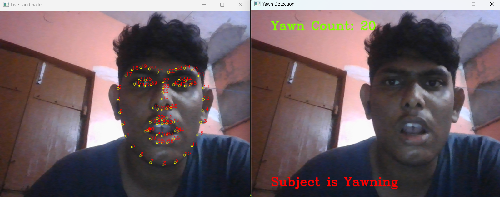
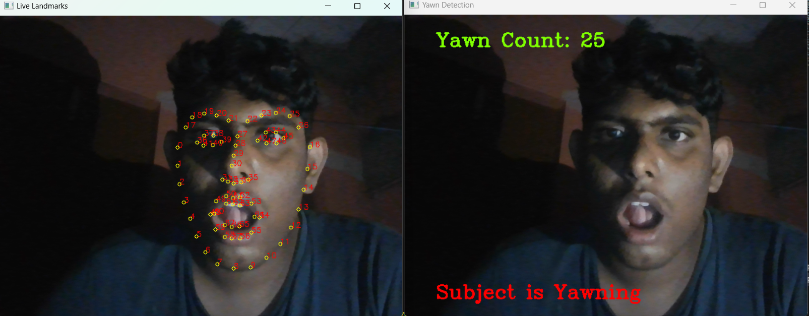
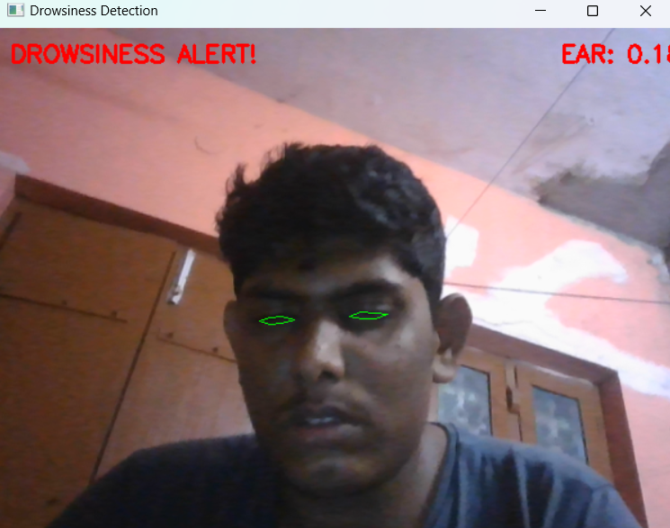
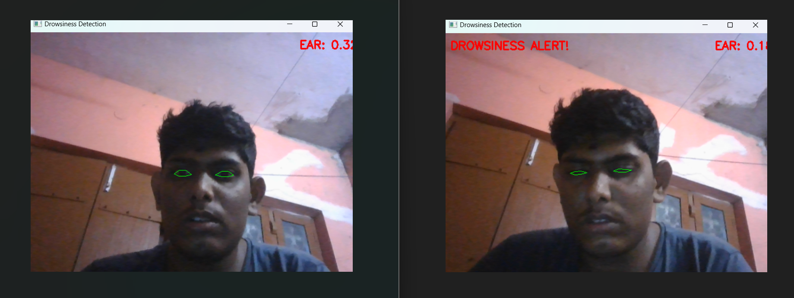

# 🚗 Driver Drowsiness Detection System

Welcome to the **Driver Drowsiness Detection System** repository! This project is designed to enhance 🚦 road safety by preventing accidents caused by driver fatigue. Using advanced 🧠 Machine Learning (ML) and Deep Learning (DL) techniques, the system monitors a driver’s alertness in real-time and provides timely ⏰ alerts.

---

## ❗ Problem

🚙 Long-distance driving and monotonous roads often lead to driver fatigue, a major cause of road accidents worldwide.  
🔍 Challenges include:  
- Detecting signs of drowsiness early enough to prevent accidents.  
- Ensuring a non-intrusive and real-time monitoring solution for drivers.

---

## ✅ Solution

Our **Driver Drowsiness Detection System** addresses this by:  
- 📷 Using a camera to monitor the driver's facial features and movements in real-time.  
- 🤖 Leveraging ML and DL models to identify fatigue indicators such as prolonged eye closure, yawning, or head tilts.  
- 🔔 Providing instant alerts (audio/visual) to re-engage the driver and avoid potential accidents.

---

## ✨ Features

- 🎥 **Real-Time Monitoring**: Tracks facial features and eye movements using a webcam.  
- 😴 **Drowsiness Detection**: Detects signs of fatigue, such as closed eyes, yawning, or head tilts.  
- 🔔 **Alert System**: Triggers alarms to notify the driver when drowsiness is detected.  
- 🎯 **High Accuracy**: Achieves up to 90% detection accuracy using pre-trained models.

---

## 📸 Output Examples

Here are some screenshots of the system in action:

### 1. **Yawn Detection**  
The system monitors the live detection of Yawn signs of person in day and night mode.
Day Mode:

Night Mode:


### 2. **Drowsy State Detected**  
When signs of fatigue, such as closed eyes or yawning, are detected, the system triggers an alert.  


### 3. **Normal State**  
The system monitors the detection of no sign of Drowsiness.  


---

## 📂 Dataset

The project uses the **[Driver Drowsiness Detection Dataset (DDD)](https://www.kaggle.com/datasets/sergiomoraes/driver-drowsiness-detection-dataset)**:  
- **Source**: Kaggle  
- **Content**:  
  - Images of drivers with labels such as *drowsy*, *alert*, or *yawning*.  
  - Includes eye state (open or closed) and facial expressions for various drowsiness scenarios.  
- **Format**: JPEG/PNG images grouped into labeled folders.

📥 **How to Use the Dataset:**  
1. Download the dataset from the provided [Kaggle link](https://www.kaggle.com/datasets/sergiomoraes/driver-drowsiness-detection-dataset).  
2. Place the dataset folder inside the `data/` directory of the project.  
3. Update the dataset path in the configuration file or script as required.

---

## 🛠️ Technologies Used

- 🐍 **Programming Language**: Python  
- 🖼️ **Libraries**: OpenCV, TensorFlow/Keras, NumPy, dlib  
- 🖥️ **Machine Learning**: For feature extraction and classification  
- 📊 **Deep Learning**: For precise image and video analysis

---

## 🚀 How It Works

1. 📷 A camera captures real-time video of the driver's face.  
2. 🗺️ Key facial landmarks (e.g., eyes, mouth) are extracted using image processing.  
3. 🤖 A pre-trained ML/DL model analyzes these features to detect signs of fatigue.  
4. 📢 If drowsiness is detected, an audible or visual alert is triggered.

---

## ⚡ How to Run the System

Follow these steps to set up and run the Driver Drowsiness Detection System:

1. **Clone the Repository**:  
   Clone the repository to your local machine using the following command:  
   ```bash  
   git clone https://github.com/yourusername/driver-drowsiness-detection.git  
